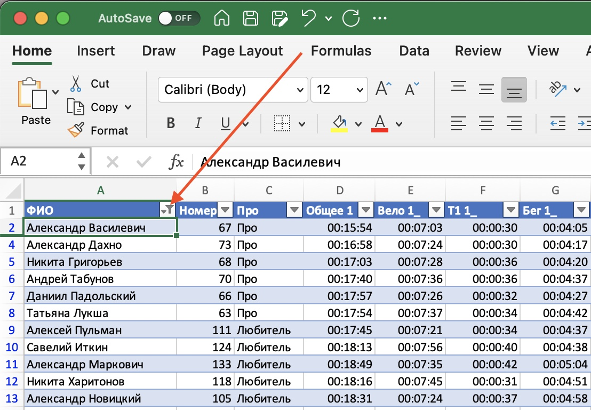
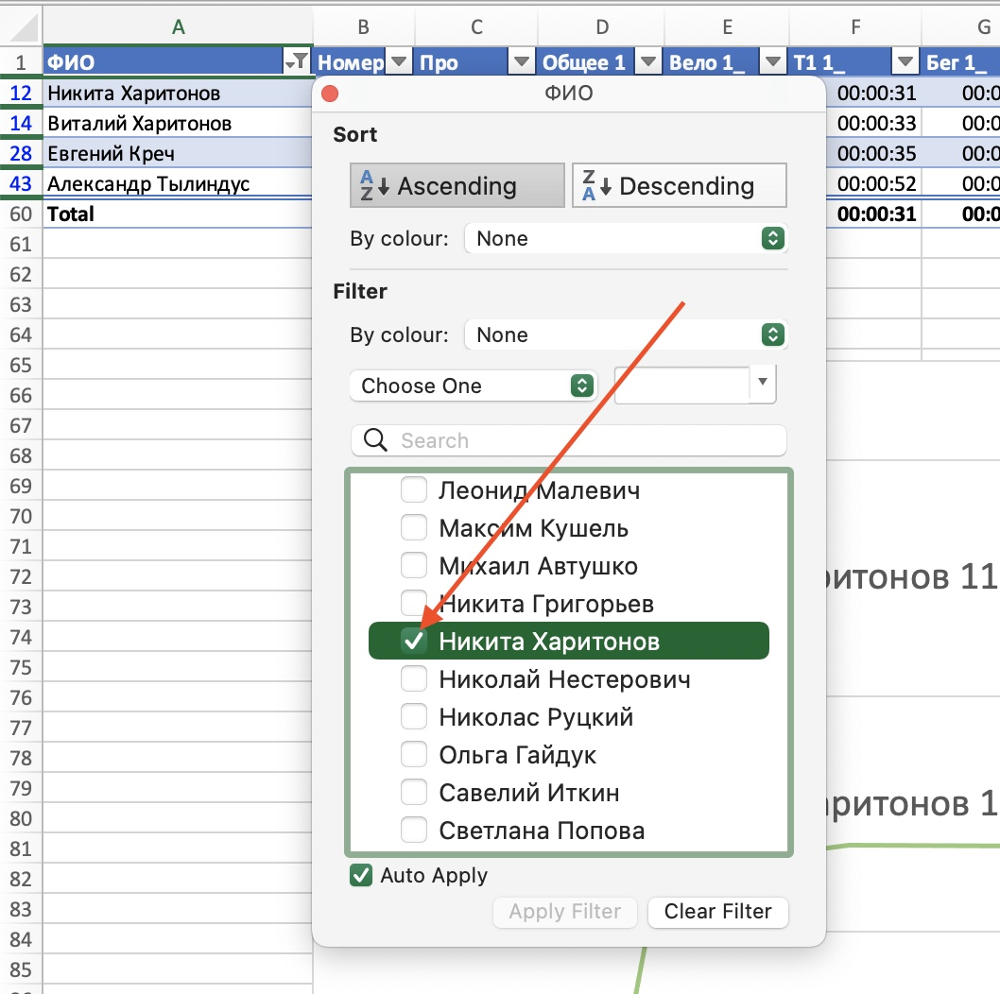
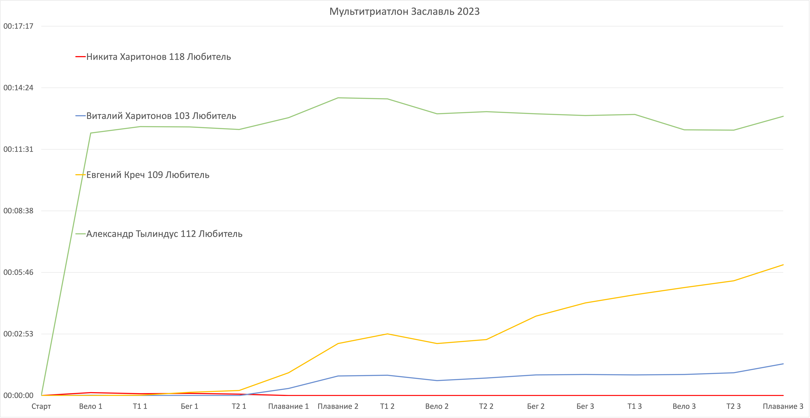

# Любительская лига триатлона Беларуси

## Список доступных результатов:
### 2023
1. [Могилев 2023 (спринт)](./Mogilev_2023)
2. [Брест 2023 (олимпийка)](./Brest_2023)
3. [Лепель 2023 (кросс-триатлон)](./Lepel_2023)
4. [Заславль 2023 (мультитриатлон)](./Zaslavl_Multitriathlon_2023)
5. [Гомель 2023 (спринт)](./Gomel_2023)
6. [Минский Триатлон 2023 (половинка)](./Minsk_Triathlon_2023)
7. [Гомель кросс-триатлон 2023](./Gomel_Kross_Triathlon_2023)
### 2024
1. [Минск Тристайл Индор 2024](./2024/Minsk_Indoor_Triathlon_2024)

## Как выбрать интересующих спортсменов для построения графика?
1. Скачать и открыть Excel документ, прикрепленный в [Telegram канале](https://t.me/triathlon_league) лиги или папке соответсвующего старта;
2. Отфильтровать таблицу результатов по фамилии или любой другой колонке. Можно выбирать участников по одному ставя галочки напротив фамилий, либо множество, используя условие. На рисунках ниже приведен пример ручного выбора участников:

3. График обновляется автоматически и содержит только тех участников, что отображаются в таблице после фильтрации:

4. График можно сохранить как картинку, для этого нажмите на него правой кнопкой -> Сохранить как картинку.
